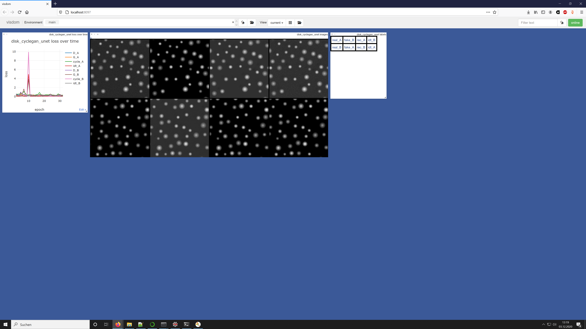
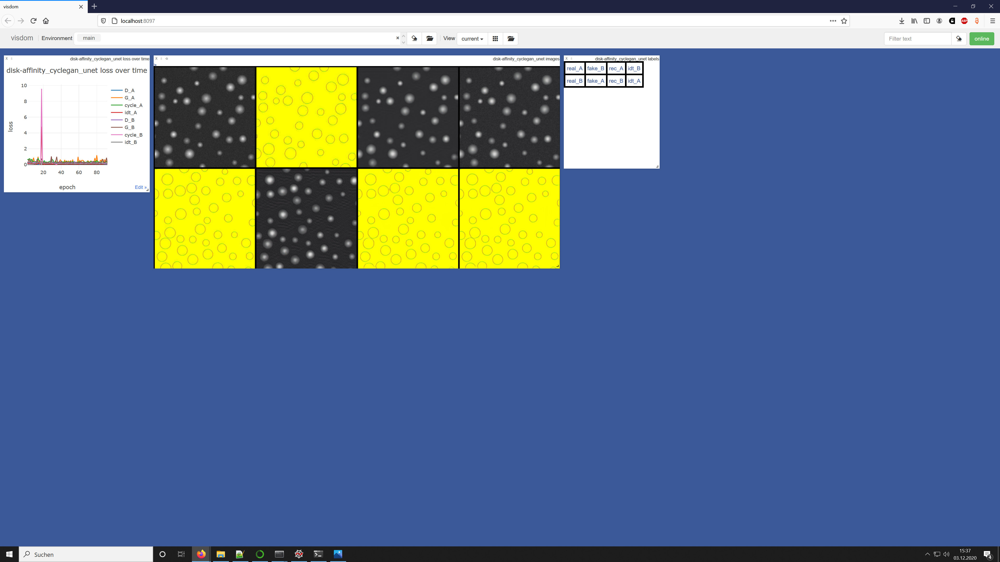

# self-supervised-segmentation
self-supervised segmentation of single species shapes via cycleGAN or differentiable rendering.


## What I did so far:
I cloned https://github.com/junyanz/pytorch-CycleGAN-and-pix2pix and made the network residual via changing the `forward` method of the `UnetGenerator` from
```python
   def forward(self, input):
        """Standard forward"""
        return self.model(input)
```
to
```python
    def forward(self, input):
        """Standard forward"""
        return input + self.model(input)
```
I created a new disk dataset with the provided script and trained a cycleGAN network on this dataset.

This seemed to work:


I checked if the spatial correspondence comes from the residual structure. So I reversed the above change and repeated training. This worked, too:


The spatial correspondence is also working for affinity maps instead of sketches:

Since affinity maps have two channels and input and output image do need the same number of channels in the cycleGAN model, there is room for improvement. Input and output channel numbers need to be the same for cycleGAN due to the identity loss in this model. I *conjecture* that the identity loss is responsible for the spatial correspondence that now can be seen, and that I couldn´t see last time with my own implementation of cycleGAN without identity loss. I did not use the identity loss, because I was using different input and output channels.

Next, I must show, that the spatial correspondence is gone, when abolishing the identity loss.

After that, I need to introduce the spatial correspondence via a new method.
