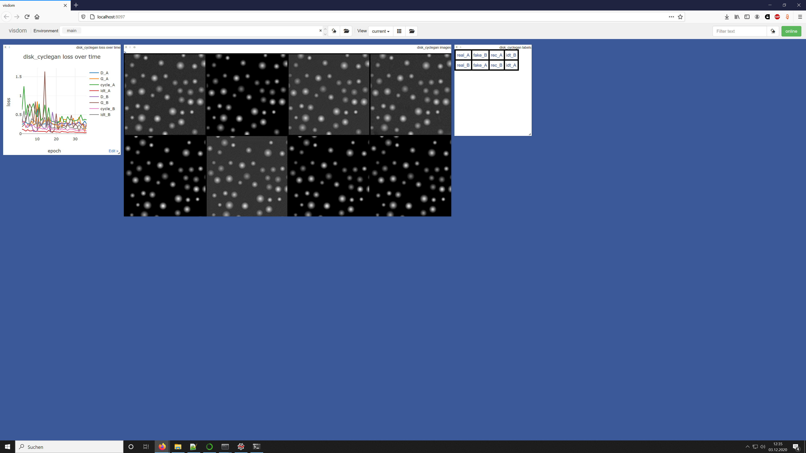

# self-supervised-segmentation
self-supervised segmentation of single species shapes via cycleGAN or differentiable rendering.


## What I did so far:
I cloned https://github.com/junyanz/pytorch-CycleGAN-and-pix2pix and made the network residual via changing the `forward` method of the `UnetGenerator` from
```python
   def forward(self, input):
        """Standard forward"""
        return self.model(input)
```
to
```python
    def forward(self, input):
        """Standard forward"""
        return input + self.model(input)
```
I created a new disk dataset with the provided script and trained a cycleGAN network on this dataset.

This seemed to work:


I checked if the spatial correspondence comes from the residual structure. So I reversed the above change and repeated training.
